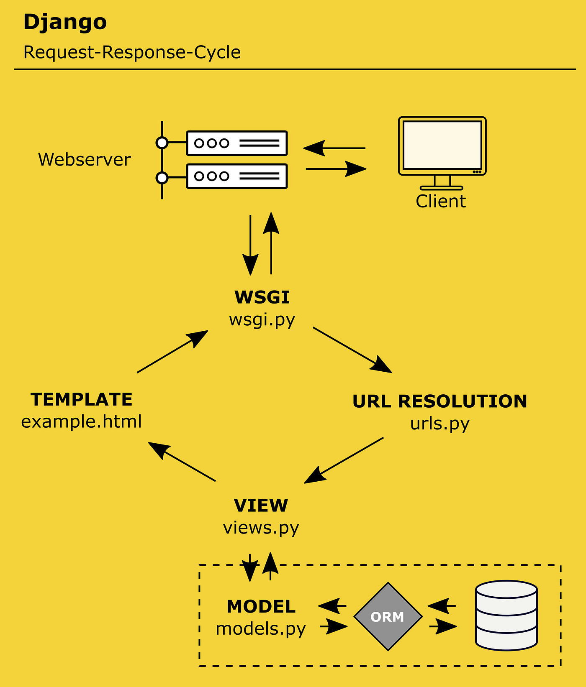

# Checklist Tugas

## Penjelasan Langkah Checklist Tugas 1
Membuat sebuah proyek Django baru: Mengaktifkan venv, menginstall dependencies-library dan menjalankan perintah startproject pada admin (Command Prompt).
Membuat aplikasi dengan nama main pada proyek tersebut.: Menjalankan perintah startapp pada admin (Command Prompt).
Melakukan routing pada proyek agar dapat menjalankan aplikasi main: Menambahkan 'main' pada installed apps di settings.py (settings.py).
Membuat model pada aplikasi main dengan nama Product dan memiliki atribut wajib: Mengisi file models sesuai intruksi (models.py).
Membuat sebuah fungsi pada views.py untuk dikembalikan ke dalam sebuah template HTML yang menampilkan nama aplikasi serta nama dan kelas kamu: Membuat fungsi pada views.py dengan mereturn fungsi render(request, [NAMA FILE HTMl].html) (views.py).
Membuat sebuah routing pada urls.py aplikasi main untuk memetakan fungsi yang telah dibuat pada views.py: Isi file urls.py pada kedua direktori sesuai tutorial (main/urls.py dan main/football_shop).
Melakukan deployment ke PWS terhadap aplikasi yang sudah dibuat sehingga nantinya dapat diakses oleh teman-temanmu melalui Internet: Login sesuai akun, buat projek, simpan username-password, atur settingan projek dengan menghubungkan .env.prod dan akses aplikasi di settings.py (PWS).
Membuat sebuah README.md: Membuat file README.md pada VSCode dan mulai menjawab pertanyaan (VS Code).

## Bagan Request Client ke Web Aplikasi berbasis Django

Saat klien memberikan request ke server, maka wsgi.py akan menghubungkan python dengan server, lalu request akan dicocokkan pada URL di urls.py (direktori proyek), lalu request akan dijalankan sesuai fungsi yang ada di urls.py dan terhubung dengan views.py, lalu fungsi di views.py (kalau berhubungan dengan model, maka views akan mengambil model dari database) berjalan dan merender file html yang terhubung dengan fungsi, hasil render tersebut dikembalikan ke klien.

## Peran settings.py dalam proyek Django
Mengatur konfigurasi, akses, database, file proyek.

## Cara kerja migrasi database di Django?
Membuat file migrasi dengan perintah 'makemigrations' dan memigrasikan data terbaru dengan perintah 'migrate', setelah menjalankan perintah migrate maka data terbaru akan menggantikan data di file migrasi yang lama.

## Alasan framework Django dijadikan permulaan pembelajaran pengembangan perangkat lunak?
Menurut saya, karena bahasa yang dipakai adalah python (mudah dipelajari) dan banyak platform yang menggunakan framework Django (lebih umum ditemukan).

## Feedback untuk asisten dosen tutorial 1 
Belum ada.