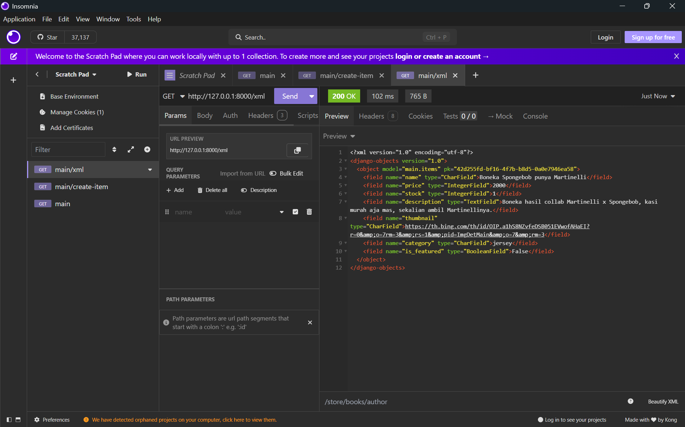

# Checklist Tugas

## Data Delivery dalam Pengimplementasian Sebuah Platform
Pada aplikasi yang membutuhkan data pengguna, data delivery dibutukan untuk mengambil dan menyampaikan data dari dan untuk klien/pengguna.  

## Lebih Baik antara XML dan JSON? Mengapa JSON lebih populer dibandingkan XML?
Semuanya memiliki kelebihan-kekurangan masing-masing sehingga tidak ada yang lebih baik dari keduanya, lalu mengapa JSON lebih populer? karena JSON lebih umum dan friendly dipake juga terintegrasi dengan javascript. 

##  Fungsi dari Method is_valid()
Mengecek kebenaran tipe atribut model dari user, tanpa method tersebut form yg diisi bisa salah arti dan fungsi.

## csrf_token pada Form di Django
Guna csrf_token untuk mengantisipasi penyerang terhadap suatu user, jika kita tidak menambahkan csrf_token maka form yang dibuat user dapat diakses dengan mudah oleh penyerang, misal form yg diisi adalah informasi pribadi user maka penyerang dapat menggunakan data tersebut untuk kepentingan pribadinya tanpa diketahui user.

## Penjelasan Langkah Checklist Tugas 3
Untuk keempat fungsi penampil data (XML/JSON), fungsi diisi dengan pengumpulan items, lalu di serialize seusai bentuk (XML/JSON), lalu menambahkan return value brupa httpresponse berbentuk XML/JSON data, lalu tiap fungsi ditambakan pada url_routing (urls.py).

Untuk fitur add dan details, akan dibuat fungsi di views sesuai konteks dan html masing-masing fitur, lalu pada tampilan awal html (main.html) ditambahkan href yang terhubung kedua html yang telah dibuat, lalu tiap fungsi ditambahkan pada url_routing (urls.py).

untuk fitur details, urlsnya spesial sesuai id pada tiap items.

## Feedback untuk asisten dosen tutorial 2
Belum ada.

## Screenshot Data Viewer (Insomnia)

![image] (static/images/jsonss.png)

